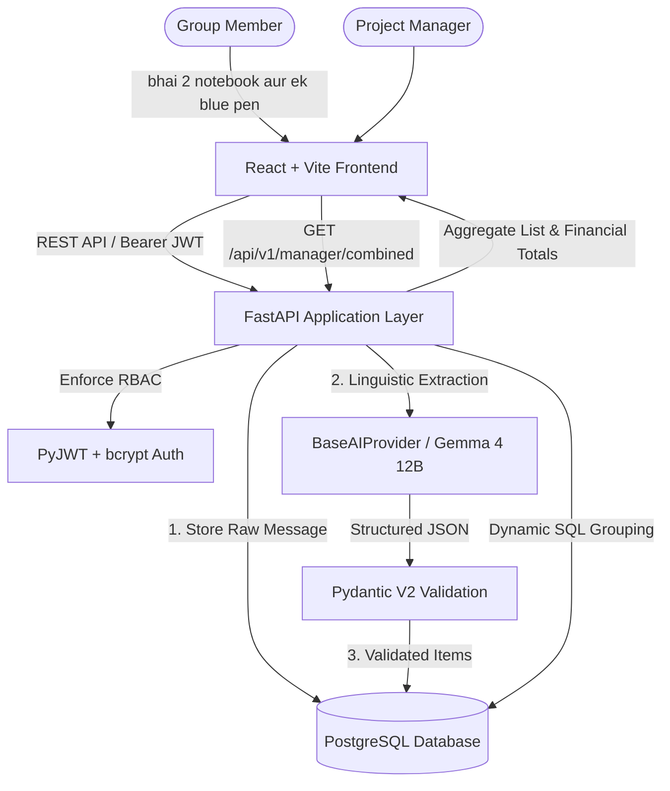

# Buy Together 🛒🤝

> **AI-Powered Group Purchasing & Request Aggregation Platform**  
> Transform conversational group requests (in English, Hindi, and Hinglish) into structured, consolidated procurement lists using Gemma 4 12B.

---

## 🌐 Live Hackathon Demo

| Component | Public HTTPS URL | Status |
| :--- | :--- | :---: |
| **Frontend Web App (Vercel)** | [`https://frontend-green-rho-88.vercel.app`](https://frontend-green-rho-88.vercel.app) | **LIVE** |
| **Frontend (Tunnel Backup)** | [`https://ascii-andrea-technological-optimum.trycloudflare.com`](https://ascii-andrea-technological-optimum.trycloudflare.com) | **LIVE** |
| **Backend API** | [`https://knee-mountain-butler-intellectual.trycloudflare.com`](https://knee-mountain-butler-intellectual.trycloudflare.com) | **LIVE** |
| **Healthcheck** | [`https://knee-mountain-butler-intellectual.trycloudflare.com/api/v1/health`](https://knee-mountain-butler-intellectual.trycloudflare.com/api/v1/health) | **PASS** |
| **Interactive API Docs**| [`https://knee-mountain-butler-intellectual.trycloudflare.com/docs`](https://knee-mountain-butler-intellectual.trycloudflare.com/docs) | **LIVE** |

> **Quick Demo**: On the live frontend, use the **1-Click Quick Demo Setup** buttons to immediately test as a **Member** or **Manager**.

---

## 📌 Project Status

- **Current State**: **Hackathon MVP Live & Verified** (Frontend, Backend, Database, AI Extraction, Member Dashboard, Manager Dashboard).
- **Backend Status**: VERIFIED (FastAPI + SQLAlchemy 2.0 + Pydantic V2 + PyJWT + bcrypt — 34/34 tests passing)
- **Frontend Status**: VERIFIED (React 19 + Vite 8 + Tailwind CSS v4)
- **AI Engine Status**: VERIFIED (`MockAIProvider` for instant demo reliability + `LocalGemmaProvider` & `HostedGemmaProvider` abstraction)
- **Database Status**: VERIFIED (SQLAlchemy 2.0 ORM models, Alembic migrations `1ea134d4c373`)


## 🎯 The Problem

In shared apartments, college dorms, student clubs, and office departments, organizing shared purchases (stationery, snacks, groceries, event supplies) is messy. Members post unstructured chat messages in WhatsApp or Slack:
> *"bhai 2 notebook aur ek blue pen"*  
> *"mere liye 1 packet A4 paper and 3 gel pens"*

The group organizer or project manager must manually copy requests into spreadsheets, combine identical items, contact vendors, calculate prices, and calculate who owes what. This process leads to missed items, purchasing errors, and hours of wasted coordination.

---

## 💡 The Solution

**Buy Together** provides a streamlined, AI-driven workflow:
1. **Natural Language Chat**: Members write what they need in conversational Hinglish or English.
2. **Gemma 4 12B Extraction**: Extracted items, quantities, units, and variants are parsed into structured JSON.
3. **Zero-Trust Validation**: Pydantic and business validation layers inspect and sanitize every field before writing to PostgreSQL.
4. **Member Self-Service**: Members can view, update, or delete their own pending requests.
5. **Manager Procurement Dashboard**: Managers view dynamic combined requirements (e.g. 15 notebooks across 5 members), assign wholesale unit prices, view computed financial totals, and export consolidated purchasing lists.

---

## 🏗 System Architecture



---

## 🛠 Tech Stack

- **Backend**: Python 3.12+, FastAPI, Uvicorn, SQLAlchemy 2.0, Pydantic V2, PyJWT, bcrypt, Alembic
- **Frontend**: React 18, Vite, Vanilla Modular CSS
- **AI & NLP**: Gemma 4 12B, HuggingFace Transformers, PyTorch, Custom Provider Abstraction
- **Database**: PostgreSQL 15+ (Production), SQLite in-memory (Automated Tests)
- **Tooling**: Git, Pytest, Docker

---

## 📂 Repository Directory Structure

```
buy-together/
├── AGENTS.md                  # Operating manual & zero-trust rules for AI coding agents
├── MEMORY.md                  # Living state ledger for model-switch continuity
├── TASKS.md                   # Granular 18-phase implementation roadmap
├── CHANGELOG.md               # Version history and releases
├── README.md                  # Project overview & documentation index
├── .env.example               # Environment variables configuration template
├── .gitignore                 # Version control exclusions
│
├── docs/                      # Technical Documentation Suite
│   ├── PRD.md                 # Product Requirements Document
│   ├── TRD.md                 # Technical Requirements Document
│   ├── ARCHITECTURE.md        # System architecture & sequence diagrams
│   ├── API.md                 # REST API specification & payloads
│   ├── DATABASE.md            # Database schema & dynamic aggregation logic
│   ├── AI.md                  # Gemma 4 12B integration & prompt templates
│   ├── SECURITY.md            # Threat model, RBAC & IDOR protections
│   ├── TESTING.md             # Testing strategy, fixtures & execution
│   ├── DEPLOYMENT.md          # Cloud deployment topology & runbooks
│   ├── DEVELOPMENT.md         # Local developer onboarding guide
│   ├── AI_AGENT_HANDOFF.md    # Agent continuity & model-switch protocol
│   └── decisions/             # Architecture Decision Records (ADRs)
│       ├── ADR-001-postgresql.md
│       ├── ADR-002-ai-provider-abstraction.md
│       ├── ADR-003-polling.md
│       └── ADR-004-dynamic-aggregation.md
│
├── backend/                   # FastAPI Backend (Phase 1+)
│   ├── app/
│   │   ├── api/               # API routers (/auth, /messages, /requests, /manager)
│   │   ├── core/              # Config, security, database session
│   │   ├── models/            # SQLAlchemy ORM models
│   │   ├── schemas/           # Pydantic request/response schemas
│   │   ├── services/          # Business logic & aggregation service
│   │   └── ai/                # AI provider abstraction & Gemma engine
│   ├── tests/                 # Pytest test suite
│   ├── alembic/               # Database migrations
│   └── requirements.txt       # Python dependencies
│
└── frontend/                  # React + Vite Frontend (Phase 11+)
    ├── src/
    │   ├── components/        # Reusable UI components
    │   ├── pages/             # Login, Register, Member, Manager
    │   ├── context/           # Auth and Data polling contexts
    │   └── services/          # API HTTP client
    └── package.json
```

---

## 🚀 Quick Start Guide

### 1. Prerequisites
- Python 3.12+ (Python 3.14 supported)
- Node.js 20+ & npm
- Git

### 2. Configure Environment
```bash
cp .env.example .env
```
*(Default settings configure `AI_PROVIDER=mock` so you can immediately test all workflows without needing a high-end GPU).*

### 3. Backend Setup
```bash
python3 -m venv .venv
source .venv/bin/activate
pip install -r backend/requirements.txt
uvicorn backend.app.main:app --reload --port 8000
```
Swagger UI will be live at `http://localhost:8000/docs`.

### 4. Frontend Setup
```bash
cd frontend
npm install
npm run dev
```
Web app will be live at `http://localhost:5173`.

### 5. Running Tests
```bash
pytest backend/tests/ -v
```

---

## 🤖 AI Provider Flexibility

Buy Together decouples AI extraction via `BaseAIProvider`:
- `AI_PROVIDER=mock`: Fast rule-based mock for testing and zero-GPU development.
- `AI_PROVIDER=local_gemma`: Direct local execution of `google/gemma-4-12b-it`.
- `AI_PROVIDER=hosted`: Serverless remote inference via HuggingFace Inference API or compatible endpoint.

---

## 📄 License & Attribution

Developed with pair-programming assistance from Antigravity. Built with modern open standards.
