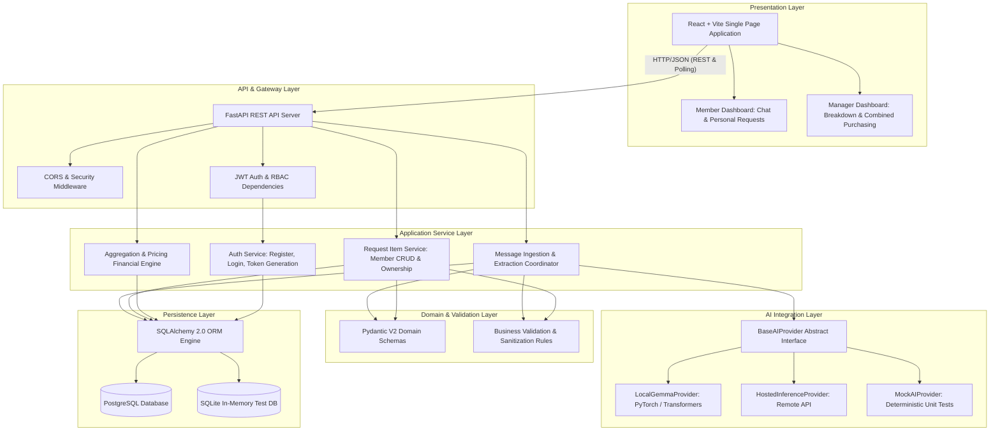
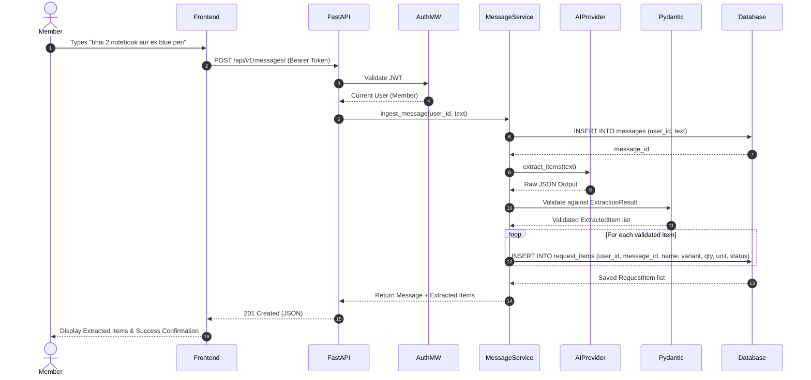
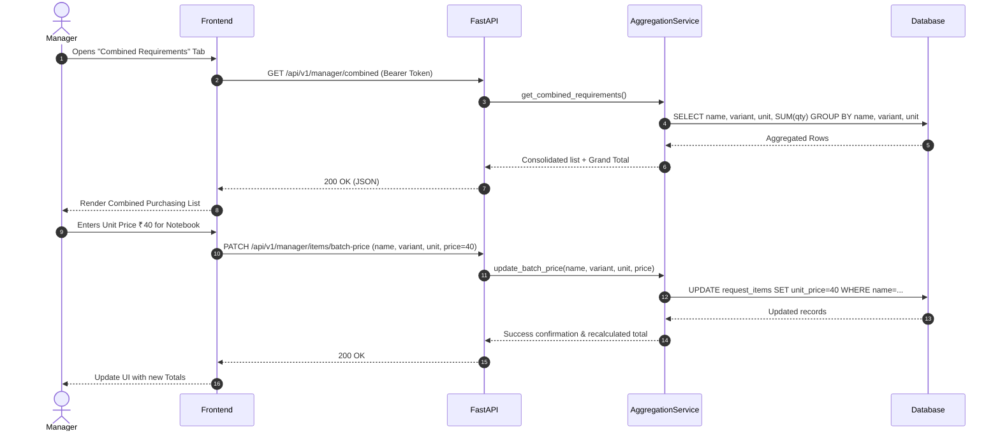

# Architecture Specification

## Project: Buy Together
**Status**: Active Architecture Guide  
**Version**: 1.0.0  

---

## 1. High-Level Architectural Diagram

---

## 2. Layered Responsibilities & Boundaries

### 2.1 Presentation Layer (Frontend)
- **Role**: Render user interface, manage client-side state, capture user natural language inputs, and poll backend updates.
- **Boundaries**: Contains zero pricing logic, zero authorization bypasses, and zero database credentials. Totals displayed in UI are received directly from backend calculations or used purely for optimistic preview.

### 2.2 API & Gateway Layer
- **Role**: Route incoming HTTP requests, enforce CORS headers, validate bearer tokens, verify role permissions (`MEMBER` vs `MANAGER`), and serialize response payloads.
- **Boundaries**: Thin controllers; does not contain SQL queries or complex business algorithms.

### 2.3 Application Service Layer
- **Role**: Coordinate workflows across domain models, AI providers, and repositories.
  - `MessageService`: Saves the raw message, queries the AI provider, runs validation, and records extracted items in a transaction.
  - `RequestService`: Enforces resource ownership before updating or deleting items.
  - `AggregationService`: Performs grouping and financial math (e.g. `sum(quantity * unit_price)`).
- **Boundaries**: Independent of the web framework (FastAPI) and AI model vendor.

### 2.4 Domain & Validation Layer
- **Role**: Enforce data integrity invariants using Pydantic V2 schemas.
  - `ItemExtraction`: Ensures item names are non-empty, quantities are positive integers (`>= 1`), and units are standard strings.
  - `UserRole`: Restricts role assignment.
- **Boundaries**: Pure Python objects; zero external network dependencies.

### 2.5 AI Integration Layer
- **Role**: Encapsulate all linguistic extraction logic behind `BaseAIProvider`.
  - Prompts are kept in version-controlled templates (`prompts/v1_extract.txt`).
  - Swapping inference engines is controlled via `AI_PROVIDER` (`mock`, `local_gemma`, `hosted`) without changing a single line of business code.
- **Boundaries**: Zero database access. Output is treated as untrusted user input until validated.

### 2.6 Persistence Layer
- **Role**: Manage ACID transactions, relational foreign keys, cascade deletes, and dynamic SQL grouping via SQLAlchemy 2.0.
- **Boundaries**: Encapsulates all SQL dialect specifics.

---

## 3. Core Data Workflows

### 3.1 Member Message Submission & Extraction Workflow

### 3.2 Dynamic Aggregation & Manager Pricing Workflow

---

## 4. Architectural Invariants & Anti-Patterns Forbidden

1. **NO AI Direct Database Operations**: The AI provider must never execute SQL, open database connections, or modify records directly.
2. **NO Redundant Aggregate Tables**: The system must NOT maintain a permanent `combined_requirements` table in MVP. Dynamic aggregation prevents data drift when requests are edited or deleted.
3. **NO Monolithic Single File Code**: Code must be separated into explicit packages (`api/`, `core/`, `models/`, `schemas/`, `services/`, `providers/`).
4. **NO Client-Determined Authorization**: The client never passes user IDs for authentication; user identity is derived strictly from the verified JWT payload.
5. **NO Trust in Client Totals**: Financial calculations must execute server-side; the server will never accept total amounts sent from the frontend.
