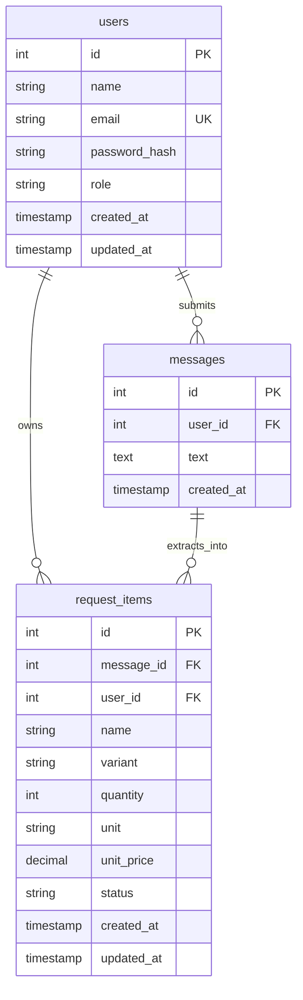

# Database Design & Architecture

## Project: Buy Together
**Engine**: PostgreSQL (Production Target) / SQLite (Automated Test Engine)  
**ORM**: SQLAlchemy 2.0+  
**Migration Tool**: Alembic  

---

## 1. Relational Schema Diagram (ERD)



---

## 2. Table Specifications

### 2.1 Table: `users`
Stores user authentication identities and role assignments.

| Column | Type | Nullable | Default | Description & Constraints |
| :--- | :--- | :--- | :--- | :--- |
| `id` | INTEGER | No | AUTO_INCREMENT | Primary Key. |
| `name` | VARCHAR(120) | No | None | Full display name. |
| `email` | VARCHAR(255) | No | None | Unique user email address; indexed. |
| `password_hash` | VARCHAR(255) | No | None | Salted bcrypt hash; never exposed. |
| `role` | VARCHAR(20) | No | `'MEMBER'` | Enum: `'MEMBER'` or `'MANAGER'`. |
| `created_at` | TIMESTAMP WITH TZ | No | `CURRENT_TIMESTAMP` | Account creation timestamp. |
| `updated_at` | TIMESTAMP WITH TZ | No | `CURRENT_TIMESTAMP` | Last updated timestamp. |

**Indexes**:
- `ix_users_email` (UNIQUE): Fast lookup during authentication.

---

### 2.2 Table: `messages`
Stores the original, immutable raw chat messages submitted by users.

| Column | Type | Nullable | Default | Description & Constraints |
| :--- | :--- | :--- | :--- | :--- |
| `id` | INTEGER | No | AUTO_INCREMENT | Primary Key. |
| `user_id` | INTEGER | No | None | Foreign Key -> `users.id` (ON DELETE CASCADE). |
| `text` | TEXT | No | None | The exact raw input (e.g. Hinglish string). |
| `created_at` | TIMESTAMP WITH TZ | No | `CURRENT_TIMESTAMP` | Message timestamp. |

**Indexes**:
- `ix_messages_user_id`: Fast lookup for user message history.

---

### 2.3 Table: `request_items`
Stores individual structured items extracted from messages or created/edited by members.

| Column | Type | Nullable | Default | Description & Constraints |
| :--- | :--- | :--- | :--- | :--- |
| `id` | INTEGER | No | AUTO_INCREMENT | Primary Key. |
| `message_id` | INTEGER | Yes | NULL | Foreign Key -> `messages.id` (ON DELETE SET NULL). |
| `user_id` | INTEGER | No | None | Foreign Key -> `users.id` (ON DELETE CASCADE). |
| `name` | VARCHAR(150) | No | None | Cleaned item name (e.g. "notebook", "pen"). |
| `variant` | VARCHAR(100) | Yes | NULL | Attribute/variant (e.g. "blue", "ruled", "500ml"). |
| `quantity` | INTEGER | No | 1 | Positive count; Check constraint `quantity > 0`. |
| `unit` | VARCHAR(50) | No | `'piece'` | Unit of measure (e.g. "piece", "packet", "kg"). |
| `unit_price` | NUMERIC(10, 2) | Yes | NULL | Manager-assigned price per unit (e.g. 40.00). |
| `status` | VARCHAR(20) | No | `'PENDING'` | Enum: `'PENDING'`, `'APPROVED'`, `'PURCHASED'`, `'REJECTED'`. |
| `created_at` | TIMESTAMP WITH TZ | No | `CURRENT_TIMESTAMP` | Record creation timestamp. |
| `updated_at` | TIMESTAMP WITH TZ | No | `CURRENT_TIMESTAMP` | Last update timestamp. |

**Indexes**:
- `ix_request_items_user_id`: Filter requests by member.
- `ix_request_items_message_id`: Link items back to source message.
- `ix_request_items_status`: Filter by procurement status.
- `ix_request_items_grouping` on `(LOWER(name), LOWER(COALESCE(variant, '')), LOWER(unit))`: Accelerates dynamic aggregation queries.

---

## 3. Dynamic Aggregation Strategy (No Redundant Table)

### 3.1 Architectural Rationale (ADR-004)
We explicitly do **NOT** maintain a persistent table called `combined_requirements`.
A persistent aggregate table introduces complex cache invalidation, write races, and synchronization drift when members edit quantities or delete items.

Instead, combined requirements are computed dynamically at query time using SQL grouping.

### 3.2 Dynamic Aggregation Query Pattern
```sql
SELECT 
    LOWER(TRIM(name)) AS normalized_name,
    NULLIF(LOWER(TRIM(variant)), '') AS normalized_variant,
    LOWER(TRIM(unit)) AS normalized_unit,
    SUM(quantity) AS total_quantity,
    MAX(unit_price) AS unit_price,
    SUM(quantity * COALESCE(unit_price, 0.00)) AS total_cost,
    COUNT(id) AS total_requests,
    ARRAY_AGG(DISTINCT users.name) AS requesting_members
FROM request_items
JOIN users ON request_items.user_id = users.id
WHERE request_items.status != 'REJECTED'
GROUP BY 
    LOWER(TRIM(name)), 
    NULLIF(LOWER(TRIM(variant)), ''), 
    LOWER(TRIM(unit))
ORDER BY normalized_name ASC;
```

---

## 4. Database Migrations (Alembic)

1. Alembic configuration resides in `backend/alembic.ini` and `backend/app/alembic/`.
2. Initial migration script: `versions/001_initial_schema.py`.
3. Commands:
   - Generate: `alembic revision --autogenerate -m "create initial tables"`
   - Apply: `alembic upgrade head`
   - Rollback: `alembic downgrade -1`
